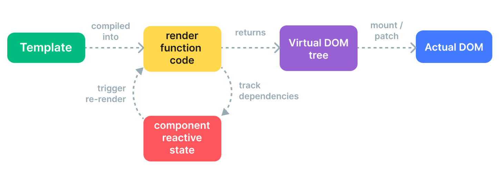
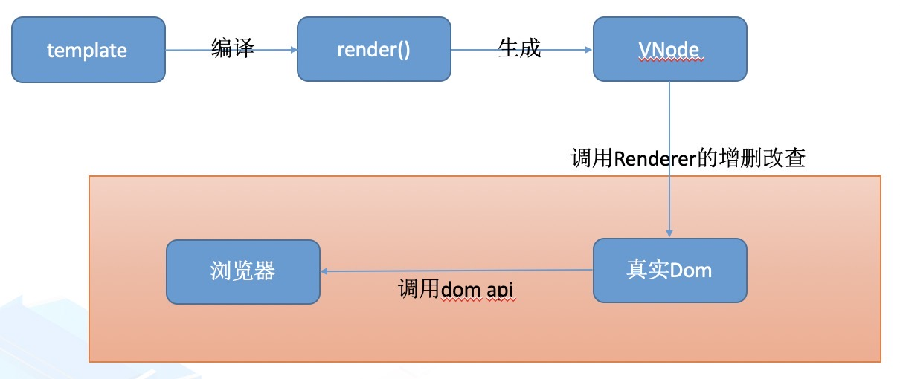

# vue 自定义渲染器
Vue的渲染过程：模版 -> 编译 -> 渲染函数 -> 虚拟Dom  -> 更新渲染





## 渲染器的作用
- 虚拟 Dom，相比 dom 标签，这种形式可以让整个 Vue 项目脱离浏览器的限制，更方便地实现 Vuejs 的跨端。

- 创建自定义渲染器。 通过提供特定平台的节点创建、操作API， 这样就可以在其他平台上充分使用Vue响应式特性。

## vue的渲染器(应用创建到挂载过程)
- createRender创建渲染器
- 创建实例并返回app应用
- 实例应用mount 实现（从虚拟dom到浏览器真实dom）


## 创建自定义渲染器 reateRenderer()

```
import { createRenderer } from '@vue/runtime-core'

const { render, createApp } = createRenderer({
  patchProp,
  insert,
  remove,
  createElement
  // ...
})

// `render` 是底层 API
// `createApp` 返回一个应用实例
export { render, createApp }

// 重新导出 Vue 的核心 API
export * from '@vue/runtime-core'
```
