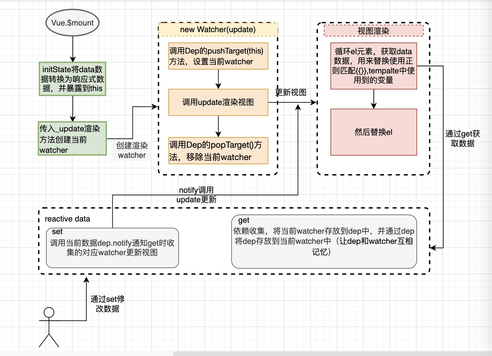

# 步骤
1. init初始化时，调用vm.$mount挂载
2. mount 传入_update渲染方法创建当前watcher
3. watcher 自动执行，完成当前watcher依赖数据的依赖收集
   1. 调用Dep的pushTarget(this)方法，设置当前watcher  Dep.target = watcher
   2. 调用2步骤传过来的update方法 this.getter
      1. 这里update会通过vm获取template依赖的变量数据(这里会走到数据劫持里的依赖收集步骤)，更新视图
   3. 调用Dep的popTarget()方法，移除当前watcher


# 依赖收集步骤
```js
dep = new Dep()
Object.defineProperty(obj, key, {
    get: function reactiveGetter () {
      const value = getter ? getter.call(obj) : val
      if (Dep.target) { // 依赖收集
        // dep.depend() // 用于让dep和watcher互相记忆 
        dep.addSub(Dep.target) // 只要取值（取值操作来自watcher），就将当前watcher添加到当前数据的依赖项里
      }
      return value
    },
    set: function reactiveSetter (newVal) {
      val = newVal
      dep.notify() // 当下次数据改变时，这里就会调用在上述get依赖收集时，收集的当前数据依赖项的watcher的update,从而更新相应视图
    }
  })
```


